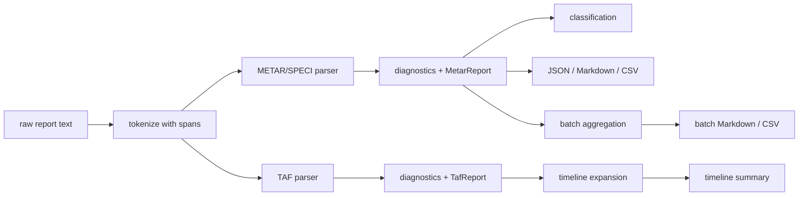

# MoonAeroWx Architecture Notes

MoonAeroWx starts with a token-preserving parser pipeline:

1. `tokenize` splits whitespace-delimited aviation weather groups and records source spans.
2. `parse_metar` recognizes common METAR/SPECI groups and emits typed fields.
3. `parse_taf` recognizes TAF issue time, valid period, initial conditions, and `FM` / `BECMG` / `TEMPO` / `PROB` / `PROB TEMPO` change groups.
4. Unrecognized regional or remark-like tokens are retained as raw tokens with warnings instead of being silently discarded.
5. `classify` computes VFR/MVFR/IFR/LIFR from configurable thresholds.
6. `taf_timeline` expands parsed TAF change groups into visualization-friendly entries. `FM` groups become replacement intervals ending at the next `FM` group or at the forecast end; `BECMG`, `TEMPO`, and probability groups remain explicit overlays.
7. `metar_to_json`, `metar_to_summary`, and `taf_timeline_to_summary` provide dependency-free output for native, JS, Wasm, and Wasm-GC targets.

Current scope intentionally covers common METAR/SPECI/TAF groups first. Rare regional extensions, RVR, runway state, wind-shear, sea-state, and richer remarks support are planned as incremental parser modules.

## Data Flow

## Parser module responsibilities

- `lexer.mbt` owns whitespace tokenization and source span preservation.
- `metar.mbt` owns METAR/SPECI recognition, including wind, visibility, RVR, weather, cloud, temperature, pressure, trend, and remark preservation.
- `taf.mbt` reuses the same weather-condition parsers for forecast base and change groups, so TAF timeline entries can carry decoded RVR and cloud/visibility context.
- `classification.mbt` keeps operational-category thresholds configurable and independent of string formatting.
- `batch.mbt` treats each input line independently and aggregates diagnostics plus category counts.
- `formats.mbt` keeps output generation dependency-free for native, JS, Wasm, and Wasm-GC targets.

## Extension points

Future parser modules should prefer this pattern:

1. Add a focused token recognizer with a precise diagnostic code.
2. Preserve unknown or unsupported regional tokens as raw data when possible.
3. Extend typed report structures only when downstream JSON/Markdown/CSV users can consume the new field.
4. Add black-box tests that cover both a valid group and at least one invalid diagnostic.
